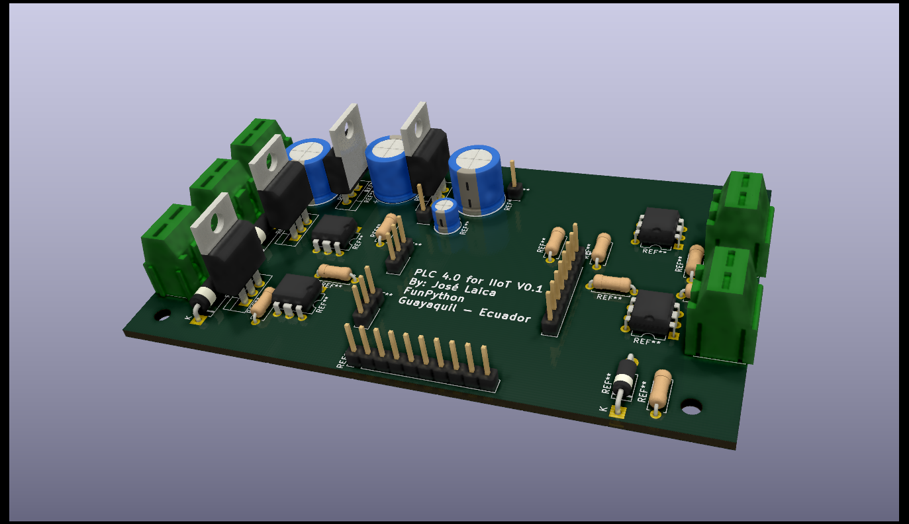
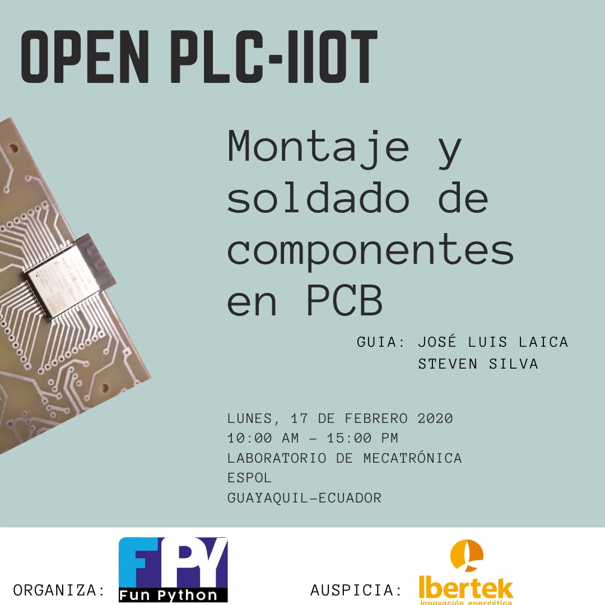

# OpenPLC-IIoTv0.1 (Industrial Internet of Things)

> Buscamos incentivar a la comunidad tecnológica al desarrollo colaborativo de nuevas plataformas para la industria bajo la filosofia de hardware y software libre.
> Construyendo un controlador lógico programable basado en el microcontrolador ESP32 y programado con Micropython.

## Acerca del PROYECTO
Los PLC (Programmable Logic Controller) se usan en la actualidad en todo tipo de aplicaciones industriales, resolviendo requerimientos en control de procesos y secuencias de la maquinaria, dentro del sector industrial en procesos y control de brazos robóticos industriales.

## Características para el hardware del PLC

Hardware     | Especificación
:---------------------------| :-------
Fuente de alimentación     | 24 voltios DC 
Entrada digitales|2; 24 voltios
Salidas digitales	| Salidas de colector abierto NPN (sumidero de corriente) de 200 mA cada una.
Entradas analógicas| 0
Cominicaciones	| 1 × puerto USB, 1 × puerto RS-485, 1 x Wifi integrado: Acces point & Station,1 x Bluetooth 4.2 2.4 Ghz; BT 2.0 y 4.0 BLE. 
Memoria | ROM: 448 KiB; for booting and core functions,SRAM: 520 KiB;For data and instruction,RTC fast SRAM: 8 KiB;For data storage and main CPU during RTC Boot from the deep-sleep mode,RTC slow SRAM: 8 KiB;For co-processor accessing during deep-sleep mode,eFuse: 1 Kibit;are used for the system (MAC address and chip configuration).
Microcontrolador | Procesador dual core Xtensa® LX6 de 32 bits, 240 Mhz,36 GPIO pins,16 x Analog-to-Digital Converter (ADC) de 12 bits de resolución y se pueden programar con límite de entrada a 1V, 2 V y 4V,2 x Digital to Analog converter DAC de 8 bits,Pueden definirse hasta 16 canales de PWM,2 x UART o puertas serie,2 x I2C channels y 4 x SPI channels,Wifi integrado: Acces point & Station,1 x Bluetooth 4.2 2.4 Ghz; BT 2.0 y 4.0 BLE
Montaje | Utiliza riel DIN estándar para el montaje
Programación | El código es cargado vía puerto micro USB

### Objetivos a corto plazo

Integrar a estudiantes, profesionales y personas a fines a la tecnologia mediante el desarrollo de proyectos en forma colaborativa, para que puedan intercambiar conocimientos, aprender y desarrollar conjuntamente. 

### Objetivos a largo plazo

La comunidad en forma indivudual o asociada, pueda mejorar y modificar estos proyectos para que puedan ser ofertados de manera local con la calidad que la insdustra requiere. 

### Metodología

Es un proyecto colaborativo de manera que en general cualquier persona externa podría colaborar incluyendo a los asistentes de las reuniones. Este se ira desenvolviendo a través de PRs ya sea al repo principal o a propios forked repos.

Tentativamente nos reuniremos todos los jueves para avanzar en grupo el desarrollo de este proyecto a pesar que se pueda trabajar individual o remotamente.

## Talleres
El proyecto se desarrollará en diversos talleres. 

1.- Diseño de la tarjeta PCB.

Tema             |Instructor | Lugar | Fecha | Horario
-----------------|-----------|-------|-------|--------
Introducción a etapas del PLC |José Laica | Laboratorio Robótica Movil - ESPOL | 21 de noviembre de 2019 | 13:30 - 15:30
Herramientas ECAD open source |José Laica | Laboratorio Robótica Movil - ESPOL | 5 de diciembre de 2019 | 13:30 - 15:30
Diseño esquematico de las etapas del PLC |José Laica | Laboratorio Robótica Movil - ESPOL | 12 de diciembre de 2019 | 13:30 - 15:30
Herramientas ECAD open source para el diseño del PCB |José Laica | Laboratorio Robótica Movil - ESPOL | 9 de Enero 2020 | 13:30 - 15:30 
Desarrollo del print circuit borad |José Laica | Laboratorio Robótica Movil - ESPOL | 16 de Enero 2020 | 13:30 - 15:30 

Herramienta a usar: https://easyeda.com/es

Esquematicos obtenidos
https://easyeda.com/jlaica/openplc32-iiot_copy

2.- Modelado 3D para diseño de "carcasa" a partir de una PCB con Freecad.

Instructor | Lugar | Fecha | Horario
-----------|-------|-------|--------
Christian Tayupanta | ESPOL | 6 de enero 2020 | 13:30 - 16:30

Herramienta a usar: https://www.freecadweb.org

Modelado PCB obtenido: 
https://github.com/FunPythonEC/PLC32/tree/master/Modelo3D_PCB

3.- Ensamblado de la PCB y programación del firmware MicroPython.

Instructor | Lugar | Fecha | Horario
-----------|-------|-------|--------
FunPython | Laboratorio de Mecatronica - ESPOL | 17 de febrero de 2020 | 10:00 - 15:00

[Link de registro para asistir](http://bit.ly/plc32fpy)

4.- Desarrollo del entorno de programación para el PLC32, basado en bloques _Drag-and-Drop._

Instructor | Lugar | Fecha | Horario
-----------|-------|-------|--------
Por definir | Por definir | febrero 2020 | vespertino

## Creadores

- [José Luis Laica](https://github.com/jlaica/jose.laica/blob/main/README.md)
- [Steven Silva](https://github.com/sasilva1998)

### Contactese con la comunidad:

funpython.ec@gmail.com 

### Redes Sociales de la comunidad FunPython

[Instagram](https://www.instagram.com/funpython/)
[Twitter](https://twitter.com/funpython_ec)

